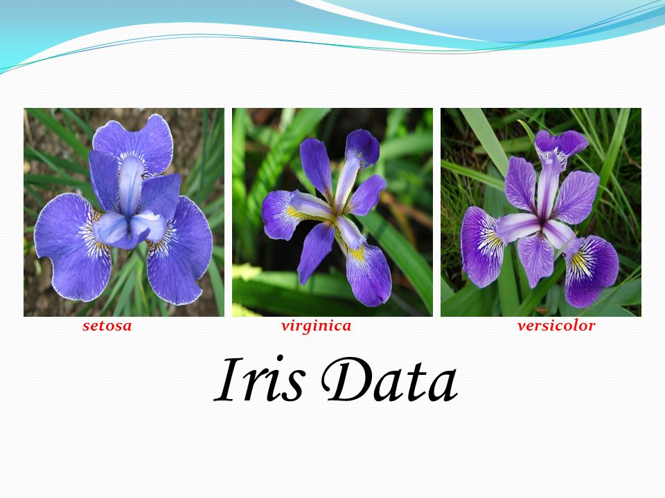
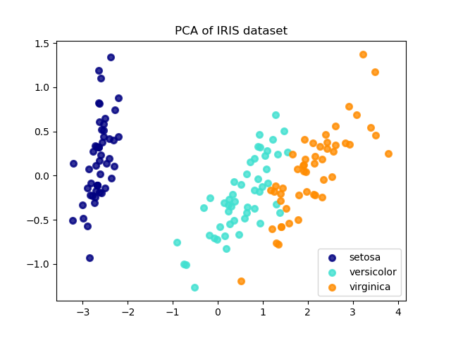

# project-iris
Project Researching Fisher's Iris Data Set

## Introduction
This project analyses Fisher's Iris Data Set using different statistical methods.

## Contents
1. History of Fisher's Iris Flower Data Set
2. How to Run the required Codes in this Repository
3. Statistics Used
4. Conclusions
5. References

### 1. History of Fisher's Iris Flower Data Set

Sir Ronald Aylmer Fisher (1890-1962) was a British statistican and geneticist.

Fisher introduced the Iris Flower Data Set in his 1936 paper.  The data set consists of three species of Iris:
1. Iris Setosa
2. Iris Virginica
3. Iris Versicolor

Fifty samples of each of the three species were analysed.  Each of the 150 samples were measured, in centimetres, and recorded in five categories

#### Categories
1. Length of the Sepals
2. Width of the Sepals
3. Length of the Petals
4. Width of the Petals
5. Class

Fisher was able to develop a linear discriminant model to distinguish each of the iris species from each other.

### 2. How to Run the Codes in this Repository

The codes in this repository were created in Visual Studio Code using IPython

#### Visual Studio Code
Visual Studio code is software written by Microsoft.  
It can be downloaded by using the following link: (https://code.visualstudio.com/download) 
When you get to this page click on the *Download* button in the top right-hand corner.
This is a large file, approximately 45,686KB, so ensure there is a high-speed internet connection before downloading.
The Visual Studio Code file will be in the downloads folder.  Click on the file and run program to install.

#### Anaconda
Anaconda is a piece of software constructed from Python which contains some extra packages.
It can be downloaded by using the following link: (https://www.anaconda.com/download/)
When you get to this page, click on the Python 3.6 Version *Download* button in the top right-hand corner.
This is a very large file, approximately 527,17KB, so ensure there is a high-speed internet connection before downloading.
The Anaconda file will be in the downloads folder.  Click on the file and run program to install.

#### IPython
IPython is the interactive programme used in Visual Studio Code.  IPython is excellent for data analytics work.
When Anaconda is installed it also installs IPython.  Go to the Command Prompt on the PC.  Type in *ipython*.  This runs the python interpreter.  This installs the ipython terminal in Visual Studio Code

#### NumPy
NumPy is a library in IPython. To use, open Visual Studio Code.  Type *ipython* in the right hand side terminal.  This opens ipython.  Then type *import numpy* this opens NumPy in IPython.

### 3. Statistics Used

The following statisical methods were used to analysis each category of the Iris data set.  To access the code click on the link following the listed value.  Answers for each value are listed at the end of the code.

1. Minimum Value (https://github.com/colettegallagher/project-iris/blob/master/minimum.py)
2. Maximum Value (https://github.com/colettegallagher/project-iris/blob/master/maximum.py)
3. Median Value (https://github.com/colettegallagher/project-iris/blob/master/median.py)
4. Mean (Average) Value (https://github.com/colettegallagher/project-iris/blob/master/mean.py)
5. Standard Deviation Value (https://github.com/colettegallagher/project-iris/blob/master/standarddeviation.py)

Histograms were used to illustrate each category.  The code for each can be found at the following link: 

The histograms produced by this code are shown below:

### 4. Conclusions

The Iris Dataset is used for data analysis and statistics.  It is a small dataset which contains 150 observations but it can be analysed using a number of statistical methods (including mean, maximum, minimum, median, standard deviation) and graphic analysis (including histograms and scatterplots)  It is a good example of real data being used for statistical learning.

### 5. References

https://en.wikipedia.org/wiki/Ronald_Fisher
http://slideplayer.com/slide/4414578/
http://web.as.uky.edu/statistics/users/pbreheny/764-f11/notes/9-20.pdf
http://scikit-learn.org/stable/_images/sphx_glr_plot_pca_vs_lda_001.png
http://archive.ics.uci.edu/ml/machine-learning-databases/iris/iris.names
http://archive.ics.uci.edu/ml/machine-learning-databases/iris/
http://www.learningaboutelectronics.com/Articles/How-to-compute-the-standard-deviation-in-Python-using-numpy.php
https://docs.scipy.org/doc/numpy/reference/generated/numpy.corrcoef.html
https://www.kaggle.com/farheen28/iris-dataset-analysis-using-knn
https://matplotlib.org/gallery/shapes_and_collections/scatter.html#sphx-glr-gallery-shapes-and-collections-scatter-py
http://patrickhoey.com/downloads/Computer_Science/03_Patrick_Hoey_Data_Visualization_Dataset_paper.pdf
http://www.cs.odu.edu/~ccartled/Teaching/2017-Fall/DataAnalysis/Presentations/030-iris-dataset.pdf
https://www.kaggle.com/sridharcr/data-analysis-iris-dataset
https://medium.com/@haydar_ai/learning-data-science-day-21-decision-tree-on-iris-dataset-267f3219a7fa
https://stats.stackexchange.com/questions/74776/what-aspects-of-the-iris-data-set-make-it-so-successful-as-an-example-teaching

