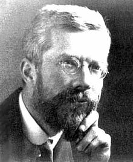

# project-iris
Project Researching Fisher's Irish Data Set

## Introduction
This project analyses Fisher's Iris Data Set using different statistical methods.

## Contents
1. History of Fisher's Iris Data Set
2. Statistics Used
3. Conclusions
4. References

### 1. History
Sir Ronald Aylmer Fisher (1890-1962) was a British statistican and geneticist.

### 2. Statistics Used

### 3. Conclusions

### 4. References

